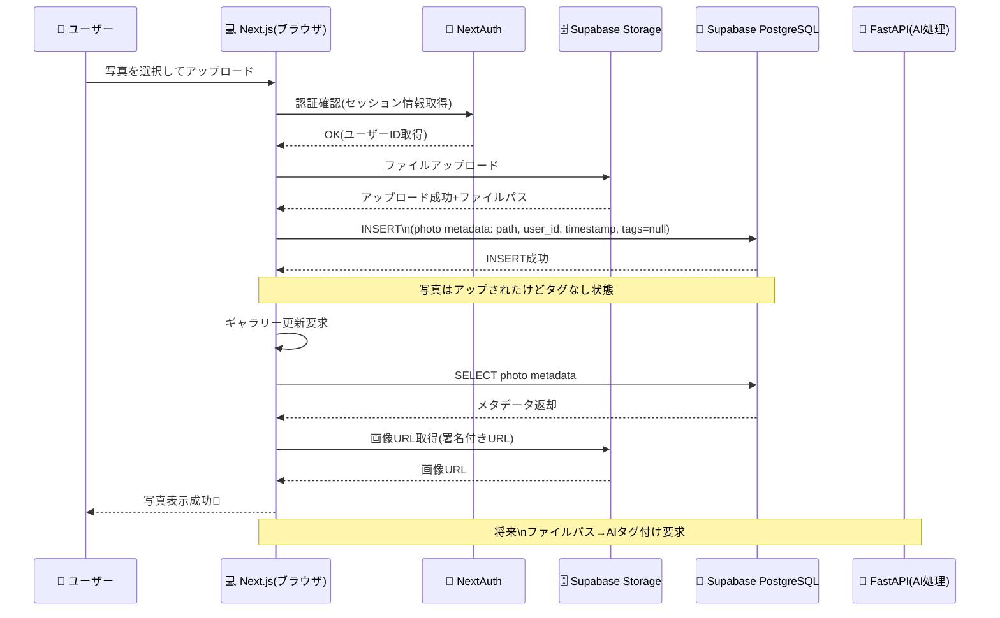

```mermaid

sequenceDiagram
    participant User as 👤 ユーザー
    participant Browser as 💻 Next.js(ブラウザ)
    participant Auth as 🔐 NextAuth
    participant Storage as 🗄️ Supabase Storage
    participant DB as 🐘 Supabase PostgreSQL
    participant API as 🤖 FastAPI(AI処理)

    User->>Browser: 写真を選択してアップロード
    Browser->>Auth: 認証確認(セッション情報取得)
    Auth-->>Browser: OK(ユーザーID取得)

    Browser->>Storage: ファイルアップロード
    Storage-->>Browser: アップロード成功+ファイルパス

    Browser->>DB: INSERT\n(photo metadata: path, user_id, timestamp, tags=null)
    DB-->>Browser: INSERT成功

    Note over Browser,DB: 写真はアップされたけどタグなし状態

    Browser->>Browser: ギャラリー更新要求

    Browser->>DB: SELECT photo metadata
    DB-->>Browser: メタデータ返却

    Browser->>Storage: 画像URL取得(署名付きURL)
    Storage-->>Browser: 画像URL

    Browser-->>User: 写真表示成功🎉

    Note over Browser,API: 将来\nファイルパス→AIタグ付け要求

```